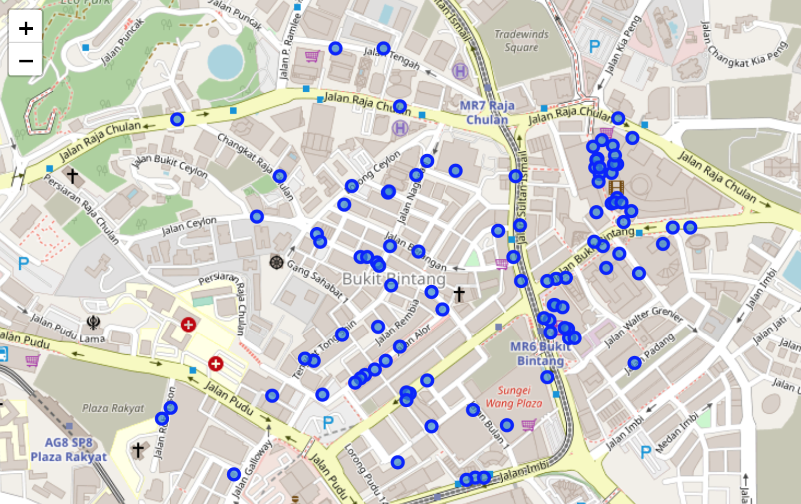
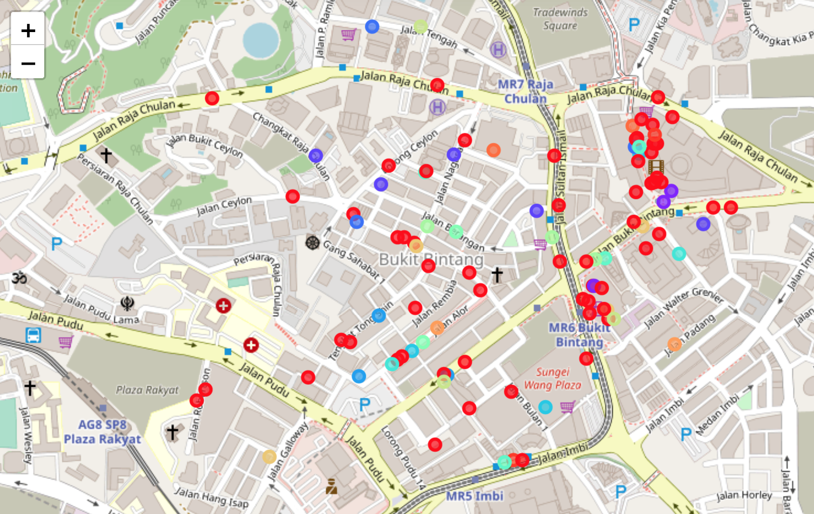

# Clustering Venues in Kuala Lumpur

## 1. Introduction

### 1.1 Background

Malaysia is one of the most famous country in tourism,  it is the destination for thousands of tourist from all over the world.

### 1.2 Problem

Since Kuala Lumpur is the capital city of Malyasia, most of the tourist start their journey from it, while it's filled with so many kinds of venues it hard to konw where to go.

### 1.3 Interest

Generally, it is important to all people but the main target we will be the tourists.

## 2. Data acquisition and cleaning

### 2.1 Data source

data have been obtain form [ foursquare website ](https://foursquare.com/) 

### 2.2 Data cleaning

Data scraped as json file with somany information such as venue name, location, categories and so on...

There are several problem with the dataset. First, data format is non readable for machine learning model so it needs to conver it into pandas data frame.

Second, drop all non importnat columns.

Third, Fill out the Null values in the selected features.

After fixing these problems the data is ready to proceed.

### 2.3 Feature selection

After cleaning the data the selected feature is venue's name, location and category

## 3. Exploratory Data Analysis

### 3.1  Venue location

Identify venues location  on the map by taking the center of Kuala Lumpur as the main point.

  

## 4. Result

After training the model using Kmeans algorithms, the model was able to cluster the venues into 15 different clusters.

